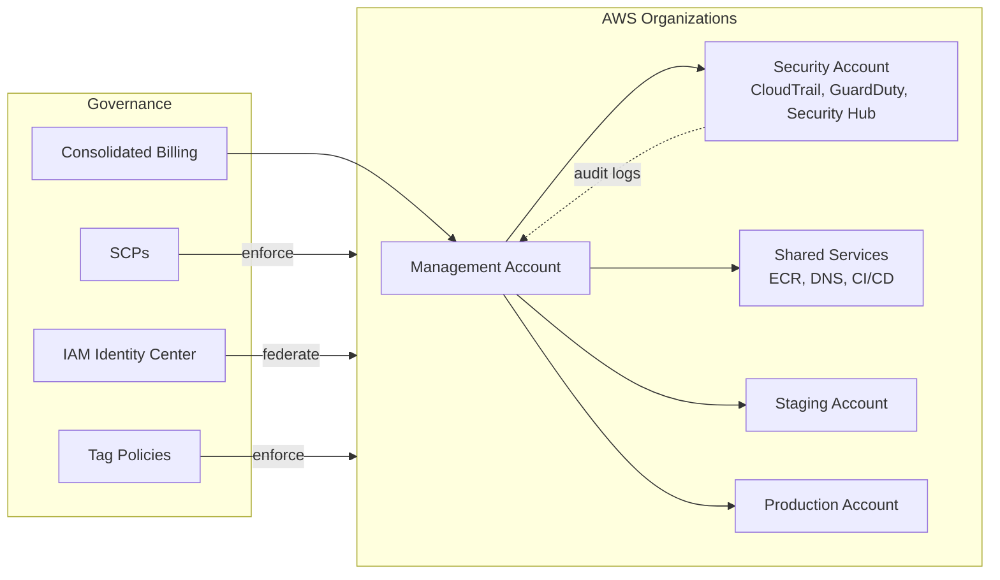
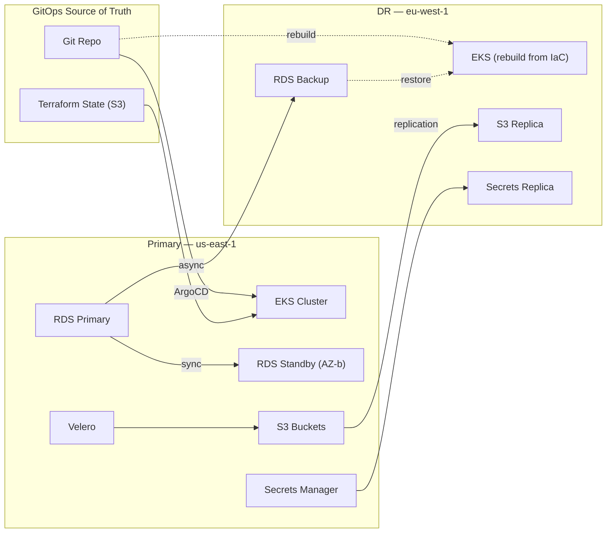
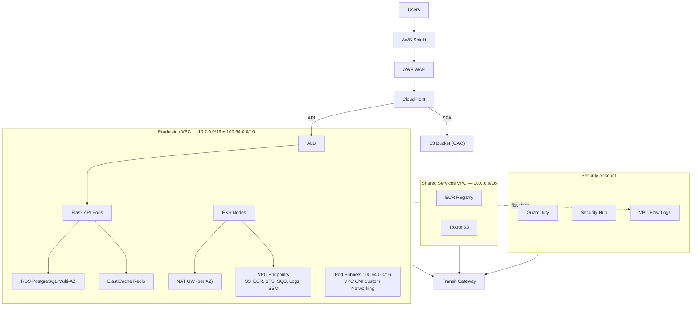
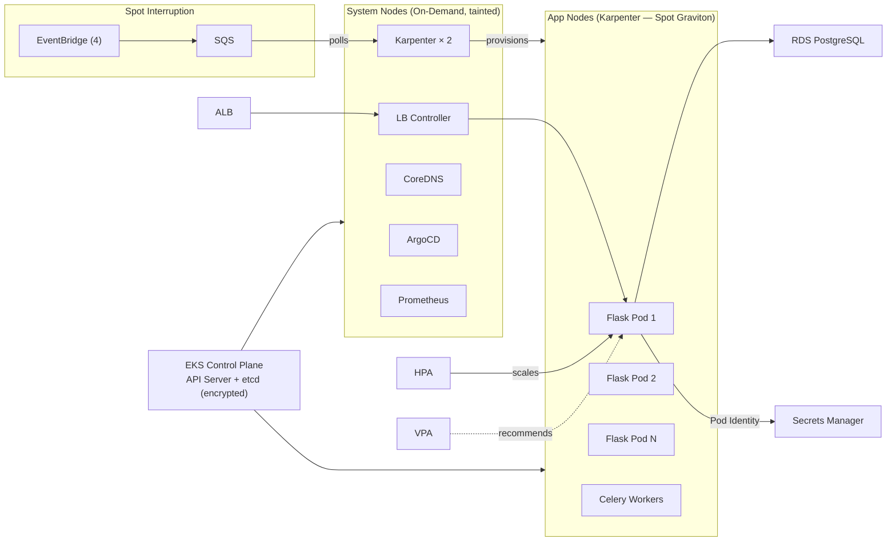
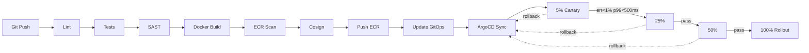
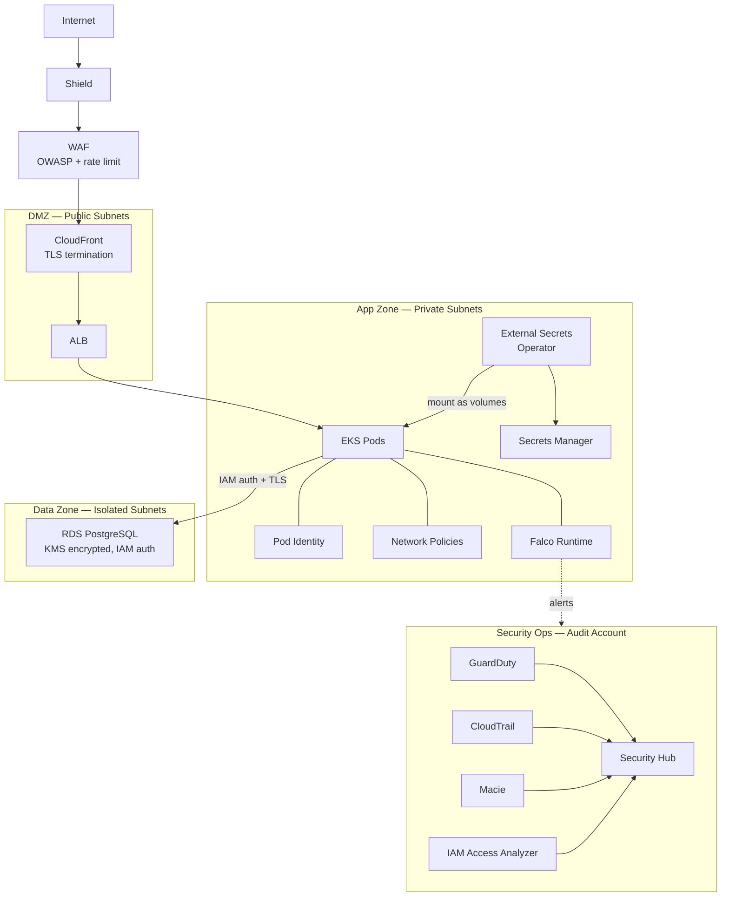
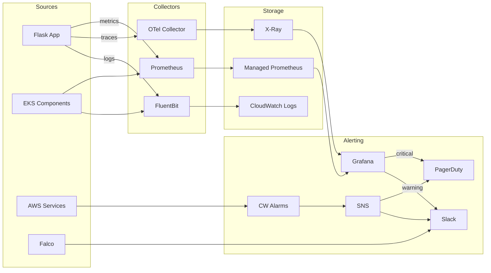

# Innovate Inc. — Cloud Architecture Design Document

**Client:** Innovate Inc.
**Platform:** Python/Flask + React + PostgreSQL
**Cloud Provider:** Amazon Web Services (AWS)
**Document Version:** 1.0
**Date:** August 2026
**Prepared by:** OpsFleet Consulting

---

## Table of Contents

1. [Executive Summary](#1-executive-summary)
2. [Cloud Environment Structure](#2-cloud-environment-structure)
3. [Network Design & DDoS/Hacker Protection](#3-network-design--ddoshacker-protection)
4. [Compute Platform — EKS](#4-compute-platform--eks)
5. [Containerization & CI/CD](#5-containerization--cicd)
6. [Database](#6-database)
7. [Security — Zero Trust End-to-End](#7-security--zero-trust-end-to-end)
8. [Observability — Full-Stack Monitoring & Alerting](#8-observability--full-stack-monitoring--alerting)
9. [Cost Optimization & FinOps](#9-cost-optimization--finops)
10. [Disaster Recovery & HA](#10-disaster-recovery--ha)
11. [Scaling Roadmap](#11-scaling-roadmap)
12. [Technology Decision Matrix](#12-technology-decision-matrix)
13. [AWS Well-Architected Framework Alignment](#13-aws-well-architected-framework-alignment)

---

## 1. Executive Summary

Innovate Inc. is an early-stage startup preparing to launch a consumer-facing web application built on a Python/Flask API backend, a React single-page application frontend, and a PostgreSQL relational database. The company has limited prior cloud operations experience, anticipates rapid growth from hundreds of daily active users to potentially millions, and processes sensitive user data subject to regulatory compliance obligations. This document presents a production-grade architecture deployed on Amazon Web Services (AWS), designed in strict alignment with the AWS Well-Architected Framework across all six pillars. The architecture emphasizes a multi-account organizational structure for blast-radius isolation, Amazon EKS as the compute platform with Karpenter-driven autoscaling on Graviton-based Spot instances for cost efficiency, a GitOps-based CI/CD pipeline using GitHub Actions and ArgoCD with canary deployments, RDS PostgreSQL with a documented upgrade path to Aurora, and a defense-in-depth security posture implementing zero-trust principles from network edge to data layer. The design is intentionally staged: the infrastructure starts lean enough for a startup budget of under $500/month, yet every component has a pre-planned scaling trigger and migration path to support millions of concurrent users without architectural rework.

---

## 2. Cloud Environment Structure

### 2.1 AWS Organizations & Account Strategy

A multi-account strategy is foundational to security isolation, billing clarity, and operational independence. Each account represents a distinct blast radius — a misconfiguration or compromise in one account cannot propagate to others. AWS Organizations provides centralized governance through Service Control Policies (SCPs) enforced at the organizational unit (OU) level.

| Account | Purpose | Organizational Unit | Key Services |
|---|---|---|---|
| **Management** | Root account for Organizations, billing, and SCPs. No workloads. | Root | AWS Organizations, Billing Console, IAM Identity Center |
| **Security / Audit** | Centralized security tooling, log aggregation, and compliance monitoring. | Security OU | CloudTrail (org-wide), GuardDuty delegated admin, Security Hub, Config aggregator, Macie |
| **Shared Services** | Shared infrastructure: DNS, CI/CD runners, container registry, artifact storage. | Infrastructure OU | Route 53 hosted zones, ECR, S3 artifact buckets, Transit Gateway hub, GitHub Actions self-hosted runners |
| **Staging** | Pre-production mirror of production. Validates releases, infrastructure changes, and database migrations. | Workloads OU | EKS, RDS, ALB, CloudFront (staging distribution), ArgoCD (staging target) |
| **Production** | Live customer-facing workloads. Strictest access controls and change management. | Workloads OU | EKS, RDS Multi-AZ, ALB, CloudFront, WAF, Shield, Secrets Manager, KMS |

### 2.2 Service Control Policies (SCPs)

SCPs are applied at the OU level and act as permission guardrails that no IAM policy can override:

- **DenyRootUsage**: Blocks all API actions when performed by the root user on all accounts except Management. This forces all human access through IAM Identity Center federated roles.
- **DenyLeavingOrganization**: Prevents any account from calling `organizations:LeaveOrganization`, ensuring accounts cannot be detached and operated outside governance.
- **RegionRestriction**: Limits resource creation to `us-east-1` and `eu-west-1` only, preventing accidental deployments in unmonitored regions and reducing compliance surface area.
- **DenyPublicS3**: Denies `s3:PutBucketPolicy` and `s3:PutAccountPublicAccessBlock` actions that would make any S3 bucket publicly accessible. The CloudFront OAC pattern is the only sanctioned path for public content delivery.

### 2.3 Identity & Access Management

All human access flows through **AWS IAM Identity Center** (successor to AWS SSO), federated against the company's identity provider (initially Google Workspace, with a migration path to Okta or Azure AD as the team grows). Permission sets are mapped to groups:

- **Administrators**: Full access to Management and Shared Services accounts. Break-glass only for Production.
- **Developers**: Read-only access to Production, read-write to Staging, full access to personal sandbox namespaces in the Staging EKS cluster.
- **Security**: Full access to Security/Audit account, read-only audit access across all accounts.
- **Billing**: Access to Cost Explorer, Budgets, and billing dashboards in the Management account only.

### 2.4 Cost Governance

- **Cost allocation tags** are enforced across all accounts: `Environment` (staging/production), `Service` (api/frontend/database), `Owner` (team email), and `CostCenter`.
- **Consolidated billing** through the Management account provides volume discount aggregation and a single invoice.
- **AWS Budgets** alerts are configured per account with thresholds at 80% and 100% of monthly forecasts.

### 2.5 Account Structure Diagram



### 2.6 DR & Backup Architecture Diagram



---

## 3. Network Design & DDoS/Hacker Protection

### 3.1 VPC Architecture & CIDR Planning

Each account operates its own VPC with non-overlapping CIDR blocks, enabling Transit Gateway peering without address conflicts.

| Account | VPC CIDR | Public Subnets | Private Subnets | Isolated Subnets |
|---|---|---|---|---|
| Shared Services | 10.0.0.0/16 | 10.0.0.0/20 (3 AZs) | 10.0.16.0/20 (3 AZs) | 10.0.32.0/20 (3 AZs) |
| Staging | 10.1.0.0/16 | 10.1.0.0/20 (3 AZs) | 10.1.16.0/20 (3 AZs) | 10.1.32.0/20 (3 AZs) |
| Production | 10.2.0.0/16 | 10.2.0.0/20 (3 AZs) | 10.2.16.0/20 (3 AZs) | 10.2.32.0/20 (3 AZs) |

**Subnet tier responsibilities:**

- **Public subnets**: Exclusively host Application Load Balancers (ALBs) and NAT Gateways. No compute instances are placed here.
- **Private subnets**: EKS worker nodes, application pods, and internal services. Outbound internet access via NAT Gateway for package downloads and external API calls.
- **Isolated subnets**: RDS instances and ElastiCache clusters. No route to the internet. Communication only with private subnets via security groups.

### 3.2 VPC Endpoints (PrivateLink)

To minimize data transfer costs and eliminate the need for traffic to traverse the public internet, the following VPC Gateway and Interface endpoints are provisioned in each workload VPC:

| Endpoint | Type | Purpose |
|---|---|---|
| S3 | Gateway | Artifact and asset access without NAT costs |
| ECR (api + dkr) | Interface | Container image pulls stay within the AWS network |
| STS | Interface | IAM role assumption for Pod Identity |
| CloudWatch Logs | Interface | Log shipping without NAT traversal |
| SQS | Interface | Async messaging (Stage 3 scaling) |
| Secrets Manager | Interface | Secret retrieval for application pods |
| SSM | Interface | Systems Manager for node management and patching |

### 3.3 Transit Gateway

A Transit Gateway in the Shared Services account interconnects all VPCs. Route tables enforce directional traffic flow: workload accounts can reach Shared Services (ECR, DNS), but cannot communicate laterally with each other. The Security account has read-only flow log access to all VPCs via centralized VPC Flow Log delivery to S3.

### 3.4 Content Delivery & Edge Architecture

- **React SPA**: Deployed to S3 with **CloudFront** distribution using **Origin Access Control (OAC)**. The S3 bucket is never publicly accessible; CloudFront authenticates via a signed OAC policy. Cache-Control headers are set for immutable hashed assets (1 year) and short TTL for `index.html` (5 minutes).
- **Flask API**: Traffic flows through **CloudFront** (for edge caching of GET responses and TLS termination) to the **Application Load Balancer** in the public subnet, which routes to EKS pods in private subnets via the AWS Load Balancer Controller target group bindings.

### 3.5 DDoS & Attack Protection

Protection is implemented in four concentric layers:

**Layer 1 — AWS Shield Standard**: Automatically included at no cost. Provides always-on detection and inline mitigation against the most common network and transport layer DDoS attacks (SYN floods, UDP reflection, DNS amplification).

**Layer 2 — AWS WAF**: Attached to both the CloudFront distribution and the ALB. Managed rule groups provide baseline protection:

- `AWSManagedRulesCommonRuleSet`: Protects against OWASP Top 10 including XSS, path traversal, and protocol violations.
- `AWSManagedRulesSQLiRuleSet`: SQL injection pattern matching across query strings, body, and headers.
- `AWSManagedRulesKnownBadInputsRuleSet`: Blocks requests matching known exploit patterns (Log4Shell, Spring4Shell, etc.).
- `AWSManagedRulesBotControlRuleSet`: Identifies and throttles automated bot traffic, protecting against scraping and credential stuffing.

**Layer 3 — Custom Rate Limiting**: A WAF rate-based rule limits each source IP to 2,000 requests per 5-minute window. Exceeding this threshold triggers a temporary block with a 403 response. API endpoints with authentication (/api/auth/*) have a stricter limit of 100 requests per 5 minutes to prevent brute-force attacks.

**Layer 4 — Geo-blocking**: An optional WAF geographic match condition can restrict traffic to specific countries. Initially disabled, this can be activated within minutes during an active attack originating from specific regions.

### 3.6 VPC Flow Logs

VPC Flow Logs are enabled on all VPCs with a 1-minute aggregation interval, published to CloudWatch Logs and archived to S3 in the Security account. These logs support forensic investigation, anomaly detection via GuardDuty, and compliance audit trails.

### 3.7 Network Topology



---

## 4. Compute Platform — EKS

### 4.1 Cluster Strategy

Amazon Elastic Kubernetes Service (EKS) is the compute platform for all containerized workloads. EKS was chosen over ECS for its ecosystem maturity, portability, and the team's ability to leverage the extensive Kubernetes tooling landscape (Helm, ArgoCD, Prometheus, etc.).

**Version strategy**: The cluster runs the **N-1** Kubernetes version (one behind latest stable). This provides access to mature, battle-tested features while avoiding early-adoption bugs. Upgrades follow a quarterly cycle: staging cluster upgraded first, production follows two weeks later after validation. EKS extended support is used to avoid forced upgrades during critical business periods.

### 4.2 Node Strategy

A dual-pool node strategy balances reliability with cost:

- **System pool (On-Demand)**: A managed node group of `m7g.large` (Graviton, ARM64) instances runs critical system workloads — CoreDNS, kube-proxy, ArgoCD, Prometheus, ingress controllers. On-Demand pricing guarantees availability for cluster-critical components.
- **Application pool (Karpenter)**: All application workloads run on nodes provisioned by **Karpenter**, configured to prefer Spot instances with Graviton instance types (`c7g`, `m7g`, `r7g` families). Karpenter's consolidation feature automatically replaces underutilized nodes, and its disruption budgets ensure graceful Spot interruption handling. On-Demand fallback is configured for when Spot capacity is unavailable.

### 4.3 Namespace Architecture

| Namespace | Purpose | Resource Quotas | Network Policy |
|---|---|---|---|
| `kube-system` | EKS system components (CoreDNS, kube-proxy, VPC CNI) | Managed by EKS | Allow DNS egress only |
| `ingress` | AWS Load Balancer Controller, external-dns | 2 CPU / 2Gi memory | Allow inbound from ALB |
| `backend` | Flask API deployments and services | 8 CPU / 16Gi memory | Allow ingress from `ingress`, egress to `database` ports |
| `frontend` | React SSR pods (if needed; otherwise SPA is fully on S3/CloudFront) | 4 CPU / 8Gi memory | Allow ingress from `ingress` only |
| `monitoring` | Prometheus, Grafana, FluentBit, OTel Collector | 4 CPU / 8Gi memory | Allow scrape access to all namespaces |

### 4.4 Autoscaling Architecture

Three layers of autoscaling work in concert:

1. **Horizontal Pod Autoscaler (HPA)**: Scales Flask API pods based on CPU utilization (target 70%) and custom Prometheus metrics (requests-per-second). Minimum 2 replicas, maximum 50.
2. **Vertical Pod Autoscaler (VPA)**: Runs in **recommendation mode only** — it does not mutate running pods. Recommendations are reviewed weekly and applied to resource requests/limits in Helm values, ensuring right-sizing without the risk of unexpected pod restarts.
3. **Karpenter (Node Autoscaler)**: Watches for unschedulable pods and provisions appropriately sized nodes within seconds. Its consolidation controller continuously evaluates whether pods can be packed more efficiently, terminating underutilized nodes to reduce cost.

### 4.5 Security Hardening

- **Network Policies**: A `deny-all` default policy is applied to every namespace. Explicit allow rules are then layered for sanctioned communication paths (e.g., backend to database on port 5432, monitoring to all namespaces on metrics port 9090).
- **Pod Security Standards (PSS)**: The `restricted` profile is enforced at the namespace level, requiring non-root containers, read-only root filesystems, dropped capabilities, and no privilege escalation.
- **LimitRanges**: Every namespace has default requests and limits applied to prevent unbounded resource consumption by any single pod.

### 4.6 EKS Architecture



---

## 5. Containerization & CI/CD

### 5.1 Container Best Practices

All Dockerfiles follow a multi-stage build pattern to minimize image size and attack surface:

**Flask API image**:
- **Stage 1 (Builder)**: `python:3.12-slim` base. Installs build dependencies, compiles wheels for all Python packages, runs unit tests.
- **Stage 2 (Runtime)**: `python:3.12-slim` base. Copies only compiled wheels and application code. Runs as non-root user `appuser` (UID 1000). Root filesystem is mounted read-only via Kubernetes `securityContext`. Final image size target: under 150MB.

**React SPA**:
- **Stage 1 (Builder)**: `node:20-alpine`. Runs `npm ci`, builds the production bundle with `npm run build`.
- **Stage 2 (Runtime)**: No runtime container needed — build artifacts are synced directly to S3 via CI pipeline. If server-side rendering is required later, an `nginx:alpine` stage serves the static files.

### 5.2 Container Registry

Amazon ECR hosts all container images with the following policies:

- **Image scanning**: Enabled on push using both Amazon Inspector (for OS package CVEs) and ECR basic scanning. Images with CRITICAL severity findings are blocked from deployment by an OPA Gatekeeper policy in EKS.
- **Lifecycle policies**: Untagged images are deleted after 7 days. Tagged images beyond the most recent 25 per repository are expired. This prevents unbounded storage growth.
- **Immutable tags**: Enabled to prevent image tag reuse, ensuring that a given tag always references the same image digest.

### 5.3 CI Pipeline — GitHub Actions

The CI pipeline runs on every pull request and on merge to `main`:

1. **Lint**: `ruff check` for Python, `eslint` for React. Fails fast on style violations.
2. **Unit Tests**: `pytest` with coverage threshold of 80%. React tests via `vitest`.
3. **SAST (Static Application Security Testing)**: `semgrep` scans for security anti-patterns (SQL injection, hardcoded secrets, insecure deserialization). `trivy fs` scans dependencies for known CVEs.
4. **Build**: Multi-stage Docker build. Image is tagged with the Git SHA for traceability.
5. **Push**: Image is pushed to ECR. The image manifest is signed with `cosign` for supply chain integrity.
6. **Update Manifest**: The CI pipeline updates the image tag in the GitOps repository (Kustomize overlay or Helm values), triggering ArgoCD synchronization.

### 5.4 CD Pipeline — ArgoCD with Canary Deployments

ArgoCD runs inside the EKS cluster and continuously reconciles the desired state (Git) with the actual state (cluster). It is configured with:

- **App of Apps pattern**: A root ArgoCD Application watches a directory of Application manifests, enabling self-managing addition of new services.
- **Automated sync** with self-heal and prune enabled for staging. Production requires manual sync approval.
- **Argo Rollouts** manages the deployment strategy for the Flask API using a canary pattern:
  - **5%** traffic → 5-minute analysis (error rate < 1%, p99 latency < 500ms)
  - **25%** traffic → 5-minute analysis
  - **50%** traffic → 10-minute analysis
  - **100%** traffic → rollout complete
  - Automatic rollback triggers if analysis thresholds are breached at any stage.

### 5.5 Infrastructure as Code — Terragrunt

All infrastructure is defined in Terraform modules orchestrated by Terragrunt for DRY multi-environment management:

```
infrastructure/
├── modules/
│   ├── vpc/
│   ├── eks/
│   ├── rds/
│   ├── ecr/
│   ├── cloudfront/
│   ├── waf/
│   └── monitoring/
├── environments/
│   ├── terragrunt.hcl          # Root config: S3 backend, provider
│   ├── dev/
│   │   ├── terragrunt.hcl      # Dev-specific variables
│   │   ├── vpc/terragrunt.hcl
│   │   ├── eks/terragrunt.hcl
│   │   └── rds/terragrunt.hcl
│   ├── staging/
│   │   ├── terragrunt.hcl
│   │   ├── vpc/terragrunt.hcl
│   │   ├── eks/terragrunt.hcl
│   │   └── rds/terragrunt.hcl
│   └── production/
│       ├── terragrunt.hcl
│       ├── vpc/terragrunt.hcl
│       ├── eks/terragrunt.hcl
│       └── rds/terragrunt.hcl
└── scripts/
    ├── apply-all.sh
    └── plan-all.sh
```

Each environment's `terragrunt.hcl` references the shared modules and overrides variables (instance sizes, replica counts, domain names). State files are stored in S3 with DynamoDB locking, one state file per module per environment.

### 5.6 CI/CD Pipeline Diagram



---

## 6. Database

### 6.1 Engine Selection: RDS PostgreSQL 16

PostgreSQL 16 on Amazon RDS is the primary data store. PostgreSQL was chosen for its robust JSON support (enabling flexible schema evolution without sacrificing relational integrity), mature ecosystem, and strong community. RDS manages patching, backups, and failover, freeing the small team from database administration overhead.

### 6.2 Why Not Aurora (Yet)

Amazon Aurora PostgreSQL offers superior performance, faster failover, and a storage engine optimized for cloud workloads. However, Aurora's minimum cost (approximately $180/month for a `db.r6g.large` with I/O-Optimized) exceeds the budget appropriate for a pre-revenue startup. RDS `db.t4g.medium` costs approximately $55/month, making it the right starting point.

**Documented upgrade path**: When any of the following triggers are met, a migration to Aurora is initiated:
- Read replica lag consistently exceeds 100ms.
- Write IOPS exceed 3,000 sustained (gp3 baseline).
- Query-per-second rate exceeds 1,000 sustained.
- The business requires sub-30-second failover (Aurora offers ~15s vs. RDS Multi-AZ ~60-120s).

The migration is executed via AWS DMS with minimal downtime using the CDC (change data capture) replication mode.

### 6.3 Instance & Storage Configuration

- **Instance**: `db.t4g.medium` (2 vCPUs, 4 GiB RAM, Graviton ARM64). Burstable T4g instances are appropriate for variable workloads typical of early-stage applications.
- **Storage**: gp3, 100GB initial allocation. gp3 provides a baseline of 3,000 IOPS and 125 MB/s throughput regardless of volume size, eliminating the need to over-provision storage for performance.
- **Multi-AZ**: Enabled from day one. The synchronous standby replica in a second AZ provides automatic failover with a typical recovery time of 60–120 seconds. This is non-negotiable for any application handling user data.

### 6.4 Backup & Recovery

- **Automated backups**: Daily snapshots with a **35-day retention period** (maximum allowed by RDS). Snapshots are taken during the configured maintenance window (Sunday 03:00–04:00 UTC).
- **Point-in-Time Recovery (PITR)**: Enabled with a 5-minute granularity. Transaction logs are continuously archived to S3, allowing restoration to any second within the retention window.
- **Cross-region backup replication**: Automated backup replication to `eu-west-1` ensures data survives a full regional outage. This is configured via RDS automated backup replication.

### 6.5 Connection Management

Database connections are a finite resource. PostgreSQL's process-per-connection model means each connection consumes approximately 10MB of RAM. At scale, connection exhaustion is the most common database failure mode.

- **Stage 1**: Application-level connection pooling via SQLAlchemy's built-in pool (pool_size=10, max_overflow=20).
- **Stage 2**: **RDS Proxy** is introduced when connection counts from multiple pod replicas exceed 80% of the `max_connections` parameter. RDS Proxy provides connection multiplexing, reducing the number of database connections by up to 90% while improving failover speed to under 30 seconds.
- **Stage 3**: If connection patterns require more granular control, **PgBouncer** deployed as a sidecar or standalone service provides transaction-mode pooling.

### 6.6 Security

- **IAM database authentication**: Enabled and preferred over password-based authentication. EKS pods assume an IAM role via Pod Identity, and generate short-lived authentication tokens to connect to RDS. No database password is stored anywhere.
- **SSL enforcement**: The `rds.force_ssl` parameter is set to `1`, rejecting any unencrypted connection attempt. TLS 1.2 is the minimum version.
- **Encryption at rest**: Enabled using a customer-managed KMS key, providing control over key rotation and access policies.

### 6.7 Schema Migrations

Database schema migrations are managed by **Alembic** (the migration framework companion to SQLAlchemy). Migrations run as a Kubernetes Job in the CI/CD pipeline, executed before the application deployment rolls out new pods. The migration job connects with a dedicated IAM role that has `CREATE`, `ALTER`, and `DROP` permissions, while the application role has only `SELECT`, `INSERT`, `UPDATE`, and `DELETE`. This separation ensures the running application cannot modify the schema, even if compromised.

---

## 7. Security — Zero Trust End-to-End

### 7.1 Zero Trust Principles

The architecture implements zero trust as a set of concrete engineering decisions, not a marketing label:

- **Never trust, always verify**: Every request is authenticated and authorized at every layer, regardless of network position. A pod in the private subnet is not inherently trusted by the database — it must present a valid IAM token.
- **Least privilege**: Every identity (human, service, pod) receives the minimum permissions required. IAM policies use explicit resource ARNs, never `*`.
- **Assume breach**: The architecture is designed to limit blast radius. Network policies, namespace isolation, separate AWS accounts, and encrypted data-at-rest ensure that compromise of a single component does not cascade.

### 7.2 AWS Account-Level Security Services

| Service | Purpose | Configuration |
|---|---|---|
| **CloudTrail** | API activity logging across all accounts | Organization trail, multi-region, log file validation enabled, S3 + CloudWatch delivery |
| **GuardDuty** | Threat detection using ML and threat intelligence | Delegated administrator in Security account, EKS audit log monitoring and runtime monitoring enabled |
| **Security Hub** | Centralized security posture dashboard | AWS Foundational Security Best Practices standard enabled, CIS AWS Benchmark enabled |
| **AWS Config** | Resource configuration compliance | Rules for encrypted EBS, public SG detection, required tags, S3 public access |
| **Macie** | Sensitive data discovery in S3 | Automated scans for PII, credentials, and financial data in all S3 buckets |
| **IAM Access Analyzer** | Detect unintended resource sharing | Zone of trust set to organization, alerts on any externally accessible resource |

### 7.3 Identity & Access

- **Human access**: Exclusively through IAM Identity Center (SSO). No IAM users with long-lived credentials exist in any account. MFA is mandatory for all SSO users.
- **Workload identity**: EKS pods authenticate to AWS services via **EKS Pod Identity** (the successor to IRSA). Each Kubernetes ServiceAccount is mapped to an IAM role with least-privilege policies.
- **Break-glass procedure**: In the event that SSO is unavailable, a sealed break-glass IAM user exists in the Management account with MFA-protected console access. The credentials are stored in a physical safe. Usage triggers a CloudTrail alarm that pages the entire engineering team.

### 7.4 Secrets Management

- **AWS Secrets Manager** stores all application secrets (database credentials, API keys, third-party tokens). Automatic rotation is enabled for the RDS master password with a 30-day cycle.
- **External Secrets Operator (ESO)** runs in EKS and synchronizes Secrets Manager entries into Kubernetes Secrets, which are mounted as volumes (never environment variables, as environment variables are visible in process listings and crash dumps).
- **Git protection**: A `.gitguardian.yml` pre-commit hook and GitHub secret scanning prevent accidental credential commits. CI fails on any detected secret pattern.

### 7.5 Container Security

- **Build-time**: Multi-stage Dockerfiles with minimal base images. No build tools, compilers, or package managers in the runtime image. All images run as non-root (UID 1000).
- **Registry scanning**: ECR enhanced scanning (powered by Amazon Inspector) runs on every image push. **Trivy** is additionally run in the CI pipeline for defense-in-depth, catching vulnerabilities that Inspector might miss or categorize differently.
- **Runtime**: **Falco** monitors system calls from all containers, alerting on anomalous behavior such as shell execution in a container, unexpected network connections, or file writes to locations outside of designated writable paths.
- **Pod Security Standards**: The `restricted` profile is enforced via namespace labels, preventing privilege escalation, host namespace access, and privileged containers.

### 7.6 Network Security (Four Layers)

1. **VPC layer**: Isolated subnets, no direct internet access for compute or data tiers, NACLs as a secondary stateless filter.
2. **Security Groups**: Stateful firewall rules. The RDS security group allows inbound TCP/5432 only from the EKS node security group. The ALB security group allows inbound TCP/443 only from CloudFront's published IP ranges (managed prefix list).
3. **Kubernetes Network Policies**: Implemented via the VPC CNI network policy controller. Default deny-all in every namespace with explicit allow rules for sanctioned traffic paths.
4. **Application layer**: Flask endpoints validate JWT tokens issued by the authentication service. Rate limiting at the application level provides defense-in-depth beyond WAF rules.

### 7.7 Data Protection

- **Encryption at rest**: KMS customer-managed keys (CMKs) encrypt all data stores: RDS, S3, EBS, ECR, CloudWatch Logs, SQS, and Secrets Manager. Key policies restrict usage to specific service roles.
- **Encryption in transit**: TLS 1.2+ is enforced on every communication path. CloudFront terminates TLS from users, re-encrypts to ALB. ALB terminates and re-encrypts to pods via HTTPS target groups. Pods connect to RDS over TLS (verified by certificate pinning). Service-to-service communication within EKS uses mTLS via a service mesh (initially Kubernetes-native, with an Istio migration path).
- **GDPR compliance**: User data is tagged with retention metadata. A data deletion pipeline processes GDPR Article 17 (right to erasure) requests within 72 hours. Personally identifiable information (PII) is identified by Macie and tracked in a data catalog.

### 7.8 Incident Response Framework

The incident response process follows a six-phase cycle:

1. **Detection**: GuardDuty findings, Security Hub alerts, Falco notifications, WAF blocked request spikes, CloudTrail anomalies.
2. **Alerting**: Critical findings trigger PagerDuty incidents. High-severity findings create Slack alerts. Medium and below are ticketed in the issue tracker.
3. **Containment**: Automated containment via Lambda functions — compromised EC2 instances have their security group replaced with an isolation group (no ingress/egress), compromised IAM roles have an explicit deny policy attached.
4. **Investigation**: CloudTrail logs, VPC Flow Logs, Kubernetes audit logs, and Falco alerts are correlated in the security dashboard. The Security account provides a centralized investigation environment.
5. **Remediation**: Root cause is addressed — vulnerable images are patched and redeployed, compromised credentials are rotated, misconfigured resources are corrected via Terraform.
6. **Post-mortem**: A blameless post-incident review is conducted within 48 hours. Findings are documented and action items are tracked to completion.

### 7.9 Security Zones Diagram



---

## 8. Observability — Full-Stack Monitoring & Alerting

### 8.1 Three Pillars of Observability

**Metrics (Prometheus + Grafana)**: Prometheus runs inside the EKS cluster, scraping metrics from application pods (via Flask's `prometheus_client` library), Kubernetes components (kube-state-metrics, node-exporter), and infrastructure exporters. Grafana provides dashboards and alerting rules. For long-term storage, Prometheus remote-writes to Amazon Managed Prometheus (AMP), providing durable metric retention beyond the local 15-day window.

**Logs (FluentBit → CloudWatch Logs)**: FluentBit runs as a DaemonSet on every node, collecting stdout/stderr from all containers. Logs are enriched with Kubernetes metadata (pod name, namespace, labels) and shipped to CloudWatch Logs. Log groups are organized by namespace and service, with a 90-day retention policy. Critical logs (authentication events, errors) are additionally forwarded to the Security account for correlation.

**Traces (OpenTelemetry → X-Ray)**: The OpenTelemetry Collector runs as a sidecar and DaemonSet, receiving traces from the Flask application (instrumented with the `opentelemetry-instrumentation-flask` package) and forwarding them to AWS X-Ray. Traces provide end-to-end visibility into request flows across services, identifying latency bottlenecks and error propagation paths.

### 8.2 Alert Rules

| Alert | Condition | Severity | Action |
|---|---|---|---|
| PodCrashLooping | `kube_pod_container_status_restarts_total` increase > 3 in 10m | Critical | PagerDuty page, investigate pod logs |
| NodeNotReady | `kube_node_status_condition{condition="Ready",status="true"} == 0` for 5m | Critical | PagerDuty page, check node health |
| HighErrorRate | 5xx responses > 5% of total requests over 5m window | Critical | PagerDuty page, check application logs and traces |
| HighLatency | p95 response time > 500ms over 5m window | Warning | Slack alert, investigate slow queries |
| DiskPressure | Node disk usage > 85% | Warning | Slack alert, investigate log volume |
| CPUThrottling | Container CPU throttled > 25% of periods over 15m | Warning | Slack alert, review resource limits |
| CertExpiring | TLS certificate expires within 14 days | Warning | Slack alert, verify cert-manager renewal |
| KarpenterQueueBacklog | Unschedulable pods > 0 for 5m | Warning | Slack alert, check Karpenter logs and instance availability |
| DatabaseConnExhausted | RDS `DatabaseConnections` > 80% of `max_connections` for 5m | Critical | PagerDuty page, evaluate RDS Proxy |
| BudgetExceeded | AWS Budget threshold > 100% of monthly forecast | Warning | Email + Slack alert, review Cost Explorer |
| GuardDutyFinding | Any HIGH or CRITICAL severity finding | Critical | PagerDuty page, initiate incident response |

### 8.3 Dashboards

Six core dashboards provide operational visibility:

1. **Cluster Overview**: Node count, pod counts by namespace, resource utilization, Karpenter provisioner status.
2. **RED Metrics (Rate, Errors, Duration)**: Request throughput, error percentages, and latency percentiles for the Flask API, broken down by endpoint.
3. **Karpenter Dashboard**: Instance type distribution, Spot vs. On-Demand ratios, consolidation events, interruption handling metrics.
4. **Cost Dashboard**: Daily and monthly spend by service, Spot savings, Reserved Instance utilization, cost anomaly alerts.
5. **SLO Burn Rate**: Error budget consumption rate for availability and latency SLOs, with multi-window alerts (1h, 6h, 24h, 30d).
6. **Security Dashboard**: GuardDuty finding trends, WAF blocked requests, failed authentication attempts, Falco alerts, CloudTrail anomaly events.

### 8.4 SLO Framework

Service Level Objectives define the reliability contract between the platform and its users:

- **Availability SLO**: 99.9% of requests return a non-5xx response, measured over a 30-day rolling window. This permits approximately 43 minutes of downtime or error per month.
- **Latency SLO**: 95% of requests complete in under 200ms (p95 ≤ 200ms), measured at the ALB. The p99 target is 500ms.

Error budgets are calculated monthly. When the error budget is less than 25% remaining, a change freeze is enacted — only bug fixes and reliability improvements are deployed until the budget recovers.

### 8.5 Observability Architecture Diagram



---

## 9. Cost Optimization & FinOps

### 9.1 Cost Optimization Strategies

The architecture applies four primary cost optimization levers:

- **Spot Instances (~60-70% savings)**: Karpenter's default provisioner prefers Spot instances across a diversified set of instance types. The broad instance family selection (c7g, m7g, r7g in multiple sizes) maximizes Spot availability and minimizes interruption rates. Fallback to On-Demand is automatic when Spot capacity is unavailable.
- **Graviton instances (~20% savings)**: ARM64-based Graviton processors offer a 20% price-performance advantage over equivalent x86 instances. All application workloads and the system node pool run on Graviton.
- **gp3 storage**: EBS gp3 volumes provide 20% lower cost than gp2 at equivalent or better performance, with independently configurable IOPS and throughput.
- **S3 Intelligent-Tiering**: All S3 buckets used for log archival, backups, and artifacts use Intelligent-Tiering, which automatically moves objects between frequent and infrequent access tiers based on usage patterns, with no retrieval fees.

### 9.2 FinOps Tooling

- **AWS Budgets**: Per-account monthly budgets with alerts at 80% and 100% thresholds. A separate budget tracks Spot vs. On-Demand spend ratios.
- **Cost Anomaly Detection**: Monitors for unexpected spending spikes using ML-based analysis. Alerts are delivered via SNS to Slack and email.
- **Cost allocation tags**: Enforced via AWS Organizations tag policies. Reports in Cost Explorer can be filtered by Environment, Service, and Owner, enabling precise cost attribution.

### 9.3 Cost Projection by Growth Stage

| Resource | Stage 1: MVP (0-1K users/day) | Stage 2: Growth (1K-100K users/day) | Stage 3: Scale (100K-1M+ users/day) |
|---|---|---|---|
| **EKS Control Plane** | $73 | $73 | $73 |
| **EKS Nodes (Spot+Graviton)** | $60-80 (2-3 nodes) | $300-800 (5-15 nodes) | $2,000-8,000 (20-80 nodes) |
| **RDS PostgreSQL** | $55 (db.t4g.medium) | $200-500 (db.r7g.large + read replica) | $1,500-4,000 (Aurora + replicas) |
| **ALB** | $25 | $50-100 | $200-500 |
| **CloudFront + S3** | $5-10 | $50-200 | $500-2,000 |
| **NAT Gateway** | $35 | $100-300 | $500-1,500 |
| **WAF** | $20 | $50-100 | $200-500 |
| **Secrets Manager** | $5 | $10-20 | $30-50 |
| **Monitoring (AMP, Grafana, CW)** | $30-50 | $100-300 | $500-1,500 |
| **Data Transfer** | $10-20 | $100-500 | $1,000-5,000 |
| **ElastiCache Redis** | — | $50-150 | $500-2,000 |
| **SQS / Lambda** | — | — | $100-500 |
| **Total Estimated Monthly** | **$350-500** | **$1,500-3,500** | **$8,000-25,000** |

These estimates assume US East (N. Virginia) pricing and include Spot and Graviton discounts where applicable. As spend becomes predictable, Savings Plans (Compute) should be evaluated for further 20-30% reduction on baseline compute.

---

## 10. Disaster Recovery & HA

### 10.1 High Availability by Default

Every component in the architecture is deployed across a minimum of two Availability Zones:

- **EKS**: Worker nodes are spread across 3 AZs. Pod anti-affinity rules ensure no two replicas of the same Deployment run in the same AZ.
- **RDS Multi-AZ**: Synchronous replication to a standby instance in a different AZ, with automatic failover.
- **ALB**: Natively distributed across all AZs in the VPC.
- **CloudFront**: Global edge network with built-in origin failover.
- **NAT Gateway**: One per AZ for fault isolation.

### 10.2 DR Tiers

| Tier | Component | RPO (Recovery Point Objective) | RTO (Recovery Time Objective) | DR Strategy |
|---|---|---|---|---|
| **Tier 1** | API + Database | 1 minute (PITR) | 15 minutes | Multi-AZ failover + cross-region backups |
| **Tier 2** | Frontend (SPA) | 0 (immutable in S3 + Git) | 5 minutes | CloudFront origin failover to secondary S3 bucket |
| **Tier 3** | Monitoring & Observability | 1 hour | 1 hour | Re-deploy from GitOps manifests |

### 10.3 Backup Strategy

- **Database**: RDS automated backups (35-day retention) + PITR + cross-region backup replication to `eu-west-1`. Monthly restore tests verify backup integrity.
- **Kubernetes manifests**: Stored in Git (source of truth). ArgoCD can reconstruct the entire cluster state from the GitOps repository.
- **Persistent Volumes**: **Velero** performs scheduled snapshots of any PersistentVolumeClaims, with backups stored in S3 with cross-region replication.
- **Secrets**: Secrets Manager provides built-in replication to a secondary region for critical secrets.

### 10.4 Runbook Outline

1. **Complete AZ failure**: Karpenter automatically provisions replacement nodes in healthy AZs. RDS fails over to standby. No manual intervention required.
2. **Complete region failure**: Restore RDS from cross-region backup in target region. Deploy EKS cluster from Terraform. Sync applications from GitOps repo. Update Route 53 DNS records. Target RTO: 4 hours.
3. **Data corruption**: Restore RDS to point-in-time before corruption event using PITR. Roll back application deployment to last known good version via ArgoCD.
4. **Security breach**: Execute incident response framework (Section 7.8). Isolate compromised resources. Rotate all credentials. Restore from verified clean backup if data integrity is compromised.

---

## 11. Scaling Roadmap

### 11.1 Stage 1: Foundation (0–1,000 users/day)

The initial deployment is lean and cost-effective:

- **Compute**: Single EKS cluster with 2-3 Karpenter-managed Spot nodes. Flask API runs 2 replicas (minimum for HA).
- **Database**: Single RDS `db.t4g.medium` instance with Multi-AZ for reliability.
- **Frontend**: React SPA on S3 + CloudFront. Zero compute cost for frontend serving.
- **Caching**: Application-level caching (Flask-Caching with simple backend). No dedicated cache infrastructure.
- **Async processing**: Synchronous request handling only. Background tasks (email, notifications) handled by a single Celery worker pod with an SQS broker.

### 11.2 Stage 2: Growth (1,000–100,000 users/day)

Triggered by monitoring alerts on database connection counts, API latency, and cache hit rates:

- **Read replicas**: A PostgreSQL read replica offloads reporting queries and read-heavy endpoints. SQLAlchemy's `binds` feature routes queries to the appropriate instance.
- **ElastiCache Redis**: A `cache.t4g.medium` Redis cluster handles session storage, API response caching, and rate-limiting counters. This offloads repetitive queries from PostgreSQL.
- **RDS Proxy**: Deployed between EKS pods and RDS to multiplex connections as pod replica counts increase.
- **Aurora evaluation**: When sustained QPS exceeds 1,000 or write IOPS consistently exceed gp3 baseline, begin the Aurora migration planning.
- **Horizontal scaling**: HPA scales Flask API pods to 10-20 replicas. Karpenter provisions additional nodes across diverse instance types.

### 11.3 Stage 3: Scale (100,000–1,000,000+ users/day)

This stage introduces architectural patterns for hyperscale:

- **Aurora Global Database**: Multi-region PostgreSQL with sub-second replication, supporting read traffic in secondary regions and near-instantaneous failover.
- **Multi-region deployment**: EKS clusters in two or more regions, with Route 53 latency-based routing directing users to the nearest cluster.
- **Event-driven architecture**: Amazon SQS decouples write-heavy operations (user activity tracking, analytics events, notification dispatch). Lambda functions process queue messages, eliminating the need for always-on Celery workers for event-driven workloads.
- **Dedicated ElastiCache cluster**: A `cache.r7g.large` Redis cluster with read replicas handles high-throughput caching and real-time session management.
- **CDN optimization**: CloudFront Functions handle edge-side logic (URL rewrites, A/B testing header injection, geolocation-based redirects) to reduce origin load.

### 11.4 Scaling Evolution Diagram

```mermaid
graph LR
    subgraph s1["Stage 1: MVP — $350-500/mo"]
        a1["EKS 2-3 Spot"]
        b1["RDS t4g.medium"]
        c1["CloudFront + S3"]
        d1["Flask × 2"]
    end

    subgraph s2["Stage 2: Growth — $1.5K-3.5K/mo"]
        a2["EKS 5-15 Nodes"]
        b2["RDS + Read Replica"]
        c2["ElastiCache Redis"]
        d2["RDS Proxy"]
        e2["Flask × 10-20 HPA"]
    end

    subgraph s3["Stage 3: Scale — $8K-25K/mo"]
        a3["Multi-Region EKS"]
        b3["Aurora Global DB"]
        c3["ElastiCache cluster"]
        d3["SQS + Lambda"]
        e3["Flask × 50+ KEDA"]
    end

    s1 -->|"DB conn >80% / p95 >200ms"| s2
    s2 -->|"QPS >1K / IOPS >3K"| s3
```



---

## 12. Technology Decision Matrix

| Component | Chosen Solution | Alternatives Considered | Why This Choice |
|---|---|---|---|
| **Cloud Provider** | AWS | GCP, Azure | Broadest service portfolio, largest community, strongest startup credit programs, team familiarity |
| **Container Orchestration** | EKS (Kubernetes) | ECS, Fargate, App Runner | Ecosystem maturity, portability, tooling breadth (Helm, ArgoCD, Prometheus), skills transferability |
| **Node Autoscaler** | Karpenter | Cluster Autoscaler | Faster provisioning (seconds vs. minutes), better Spot handling, consolidation, right-sized nodes |
| **CI Platform** | GitHub Actions | GitLab CI, Jenkins, CircleCI | Native GitHub integration, generous free tier, extensive marketplace, low operational overhead |
| **CD Platform** | ArgoCD | Flux, Spinnaker, GitHub Actions | Mature GitOps model, excellent UI for deployment visibility, Argo Rollouts integration |
| **Deployment Strategy** | Argo Rollouts (Canary) | Rolling update, Blue/Green | Gradual traffic shifting with automated analysis reduces blast radius of bad deployments |
| **IaC Tool** | Terraform + Terragrunt | CloudFormation, Pulumi, CDK | Cloud-agnostic, massive provider ecosystem, Terragrunt enables DRY multi-env management |
| **Database** | RDS PostgreSQL 16 | Aurora, DynamoDB, CockroachDB | Lowest startup cost with documented Aurora upgrade path, team PostgreSQL expertise, relational model fit |
| **Caching** | ElastiCache Redis | Memcached, DAX | Rich data structures, persistence options, pub/sub for real-time features, broad client support |
| **Frontend Hosting** | S3 + CloudFront | EKS (nginx), Amplify, Vercel | Zero compute cost, global edge delivery, simple deployment (S3 sync), infinite scalability |
| **Secrets Management** | Secrets Manager + ESO | Parameter Store, Vault | Native AWS integration, automatic rotation, ESO provides clean Kubernetes-native interface |
| **Monitoring** | Prometheus + Grafana (AMP) | Datadog, New Relic, CloudWatch native | No per-host licensing, full control, AMP provides managed storage, Grafana provides rich visualization |
| **Logging** | FluentBit + CloudWatch | ELK Stack, Loki | Low resource footprint, native CW integration, avoids Elasticsearch operational overhead |
| **Tracing** | OpenTelemetry + X-Ray | Jaeger, Zipkin | Vendor-neutral instrumentation, X-Ray provides native AWS integration and service map |
| **Security Scanning** | Trivy + ECR Inspector | Snyk, Aqua, Prisma Cloud | Open-source (Trivy) + managed (Inspector) provides defense-in-depth at zero additional licensing cost |
| **Runtime Security** | Falco | Sysdig Secure, Aqua Runtime | Open-source, CNCF graduated project, strong community, syscall-level visibility |

---

## 13. AWS Well-Architected Framework Alignment

### Operational Excellence

The architecture embeds operational excellence through infrastructure-as-code (Terraform/Terragrunt), GitOps-driven deployments (ArgoCD), and comprehensive observability (Prometheus, FluentBit, OpenTelemetry). Every infrastructure change is version-controlled, peer-reviewed, and applied through automated pipelines. Runbooks document responses to common failure scenarios. Post-incident reviews drive continuous improvement. The canary deployment strategy with automated analysis ensures that operational risk from deployments is systematically minimized.

### Security

Security is implemented as defense-in-depth across every layer. The multi-account structure provides blast-radius isolation. SCPs enforce organizational guardrails that no individual IAM policy can override. Zero-trust networking ensures no implicit trust based on network position. All data is encrypted at rest (KMS) and in transit (TLS 1.2+). Identity is federated through SSO with MFA enforcement. Container images are scanned at build time (Trivy) and registry time (Inspector), and runtime behavior is monitored by Falco. AWS-native security services (GuardDuty, Security Hub, CloudTrail, Macie, Config, IAM Access Analyzer) provide continuous posture assessment and threat detection.

### Reliability

Multi-AZ deployment is the default for every stateful and stateless component. RDS Multi-AZ provides automatic database failover. EKS pods are distributed across AZs with anti-affinity rules. Karpenter ensures that node failures are automatically remediated by provisioning replacement capacity. The canary deployment strategy prevents bad releases from affecting all users simultaneously. Backups are automated, tested monthly, and replicated cross-region. The SLO framework (99.9% availability) provides a measurable reliability target with error budget policies that gate deployment velocity.

### Performance Efficiency

Graviton-based ARM64 instances deliver superior price-performance. Karpenter right-sizes nodes to workload requirements rather than maintaining a static pool of potentially oversized instances. HPA scales pods horizontally based on real-time demand signals. CloudFront caches static assets at the edge, reducing origin load and user-perceived latency. RDS read replicas (Stage 2) and ElastiCache (Stage 2-3) offload database queries. The SLO framework tracks p95 latency (200ms target), ensuring performance is continuously measured and maintained.

### Cost Optimization

The architecture starts at $350-500/month, appropriate for a pre-revenue startup, and scales cost-proportionally with growth. Spot instances provide 60-70% compute savings. Graviton instances add 20% price-performance improvement. gp3 storage eliminates the gp2 cost-performance coupling. S3 Intelligent-Tiering automatically optimizes storage costs. Karpenter's consolidation feature continuously packs workloads onto fewer nodes, preventing resource waste. AWS Budgets, Cost Anomaly Detection, and cost allocation tags provide visibility and governance. The staged scaling roadmap ensures infrastructure investment aligns with actual user growth rather than speculative capacity planning.

### Sustainability

Graviton processors are ARM-based and deliver more performance per watt than x86 equivalents, reducing the energy footprint of compute workloads. Spot instances utilize spare AWS capacity that would otherwise sit idle, improving overall data center utilization. Karpenter's consolidation minimizes the number of running instances. S3 Intelligent-Tiering reduces the storage footprint by automatically archiving infrequently accessed data. CloudFront edge caching reduces the number of requests that traverse the network to origin servers. The architecture's autoscaling design ensures resources are provisioned only when needed and released when demand subsides, avoiding the sustainability cost of over-provisioned infrastructure.

---

*This document is a living artifact. It will be reviewed and updated quarterly, or upon any significant change to the application architecture, team size, regulatory requirements, or user growth trajectory. Version history is maintained in Git.*
