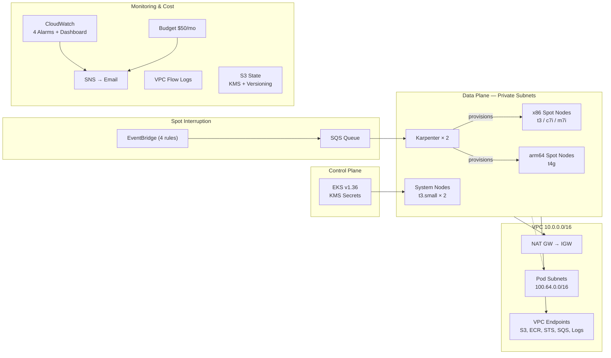

# EKS + Karpenter Infrastructure

Production-grade Amazon EKS cluster with Karpenter autoscaling, supporting both x86 (amd64) and arm64 (Graviton) instance types with Spot instance preference.

## Architecture Overview



## What's Here, What's Used, and Why

| Component | Technology | Purpose |
|-----------|-----------|---------|
| **VPC** | `terraform-aws-modules/vpc/aws` v5.21 | 3-AZ network with separate pod CIDR (100.64.0.0/16) to avoid IP exhaustion on the primary range |
| **EKS** | `terraform-aws-modules/eks/aws` ~20.31 | Managed Kubernetes v1.36 with KMS envelope encryption, full audit logging, Pod Identity |
| **System Nodes** | EKS Managed Node Group (t3.small × 2) | Tainted system workloads: CoreDNS, Karpenter controllers, kube-proxy, Pod Identity Agent |
| **Karpenter** | Helm chart v1.3.3 + Karpenter submodule | Just-in-time node provisioning with two pools: x86 (weight 40) and arm64/Graviton (weight 60, preferred) |
| **Spot Handling** | SQS + EventBridge (4 rules) | Graceful node drainage on Spot interruption, rebalance, health events, and state changes |
| **VPC CNI** | Custom networking + prefix delegation | Pods get IPs from secondary CIDR via ENIConfig CRDs — isolates pod networking from node networking |
| **VPC Endpoints** | Gateway (S3, DynamoDB) + Interface (8 services) | Eliminates NAT costs for AWS API calls; required for private-only clusters |
| **VPC Flow Logs** | CloudWatch Logs (14d retention) | Network forensics and compliance auditing |
| **Monitoring** | CloudWatch alarms + dashboard | NAT errors, SQS queue depth, message age — alerts via SNS |
| **Billing** | AWS Budgets | 80% forecasted and 100% actual alerts on $50/month limit |
| **State Backend** | S3 + DynamoDB + KMS | Encrypted, versioned, TLS-enforced remote state with locking |
| **Security** | IMDSv2, EBS encryption, KMS, least-privilege IAM | Defense-in-depth across compute, storage, and identity layers |

## Prerequisites

- **Terraform** >= 1.7
- **AWS CLI** v2 configured with appropriate credentials
- **kubectl** matching your cluster version
- **Helm** v3

```bash
# Verify tools
terraform version
aws sts get-caller-identity
kubectl version --client
helm version
```

## Quick Start

### 1. Bootstrap State Backend

```bash
cd terraform/bootstrap
terraform init
terraform apply
```

This creates the S3 bucket (KMS-encrypted, versioned), DynamoDB lock table, and KMS key.

### 2. Deploy the Cluster

```bash
cd terraform/
terraform init
terraform apply
```

Deployment takes approximately 15-20 minutes (EKS control plane creation is the bottleneck).

### 3. Configure kubectl

```bash
aws eks update-kubeconfig --region us-east-1 --name opsfleet-eks
kubectl get nodes
```

### 4. Verify Karpenter

```bash
kubectl get nodepools
kubectl get ec2nodeclasses
kubectl get pods -n kube-system -l app.kubernetes.io/name=karpenter
```

## Example Workloads

Deploy test workloads to verify multi-architecture support:

```bash
# x86 workload — triggers x86-general NodePool
kubectl apply -f examples/nginx-x86.yaml

# arm64 workload — triggers arm64-graviton NodePool
kubectl apply -f examples/nginx-arm64.yaml

# Multi-arch with topology spread
kubectl apply -f examples/nginx-multi-arch.yaml

# Spot-aware with graceful shutdown
kubectl apply -f examples/spot-graceful.yaml
```

Monitor Karpenter provisioning:

```bash
kubectl logs -n kube-system -l app.kubernetes.io/name=karpenter -f
kubectl get nodeclaims
kubectl get nodes -L kubernetes.io/arch,karpenter.sh/capacity-type,karpenter.sh/nodepool
```

## Testing

### Static Tests

```bash
chmod +x tests/static/validate.sh
./tests/static/validate.sh
```

Validates: formatting, configuration validity, no hardcoded account IDs, variable/output descriptions, YAML syntax, .gitignore coverage, no TODOs.

### Live Tests (Post-Deploy)

```bash
chmod +x tests/live/validate_cluster.sh
./tests/live/validate_cluster.sh opsfleet-eks us-east-1
```

Validates 20+ checks: cluster status, version, encryption, logging, node readiness, Karpenter controllers/NodePools/NodeClass, SQS/EventBridge, VPC/Flow Logs/endpoints, CloudWatch alarms, workload scheduling (x86 + arm64), Spot verification.

## Configuration

| Variable | Default | Description |
|----------|---------|-------------|
| `project_name` | `opsfleet` | Prefix for all resource names |
| `environment` | `poc` | Environment identifier (`poc`, `staging`, `production`) |
| `region` | `us-east-1` | AWS region |
| `cluster_name` | `opsfleet-eks` | EKS cluster name |
| `cluster_version` | `1.36` | Kubernetes version |
| `vpc_cidr` | `10.0.0.0/16` | Primary CIDR for nodes |
| `pod_cidr` | `100.64.0.0/16` | Secondary CIDR for pod networking |
| `system_node_instance_types` | `["t3.small"]` | Instance types for system nodes |
| `system_node_min_size` | `2` | Min system nodes |
| `system_node_max_size` | `3` | Max system nodes |
| `karpenter_version` | `1.3.3` | Karpenter Helm chart version |
| `enable_monitoring` | `true` | Create CloudWatch alarms/dashboard |
| `alert_email` | `""` | Email for alarm notifications |
| `monthly_budget_amount` | `50` | Monthly AWS budget (USD) |

## Cleanup

Reverse order to avoid dependency errors:

```bash
# 1. Delete workloads (triggers Karpenter node drain)
kubectl delete -f examples/ --ignore-not-found

# 2. Wait for Karpenter to terminate nodes
kubectl get nodes -w  # wait until only system nodes remain

# 3. Destroy infrastructure
cd terraform/
terraform destroy

# 4. Destroy state backend
cd terraform/bootstrap
terraform destroy

# 5. Verify nothing remains
aws eks list-clusters --region us-east-1
aws ec2 describe-vpcs --filters "Name=tag:Project,Values=opsfleet" --region us-east-1
```

## File Structure

```
terraform/
├── bootstrap/           # State backend (S3 + DynamoDB + KMS)
│   ├── main.tf
│   ├── variables.tf
│   ├── outputs.tf
│   └── versions.tf
├── examples/            # K8s manifests for testing
│   ├── nginx-x86.yaml
│   ├── nginx-arm64.yaml
│   ├── nginx-multi-arch.yaml
│   └── spot-graceful.yaml
├── tests/
│   ├── static/          # Pre-deploy validation
│   │   └── validate.sh
│   └── live/            # Post-deploy validation
│       └── validate_cluster.sh
├── backend.tf           # S3 remote state config
├── billing.tf           # AWS Budgets
├── data.tf              # Data sources
├── eks.tf               # EKS cluster + ENIConfig
├── karpenter.tf         # Karpenter IAM + Helm + NodePools + EC2NodeClass
├── locals.tf            # Computed values + tags
├── monitoring.tf        # CloudWatch alarms + dashboard
├── outputs.tf           # Stack outputs
├── providers.tf         # Provider configs
├── variables.tf         # Input variables
├── versions.tf          # Version constraints
└── vpc.tf               # VPC + subnets + endpoints + flow logs
```

## Security Highlights

- **KMS Encryption**: EKS secrets, EBS volumes, S3 state, SQS queues
- **IMDSv2 Required**: Instance metadata hardened against SSRF
- **Pod Network Isolation**: Dedicated CIDR separates pod traffic from node management
- **VPC Endpoints**: AWS API traffic never traverses the public internet
- **Least-Privilege IAM**: Karpenter uses Pod Identity with scoped permissions
- **TLS Enforced**: State bucket rejects non-HTTPS requests
- **VPC Flow Logs**: All network traffic recorded for forensics
- **No Public Nodes**: Worker nodes in private subnets only
